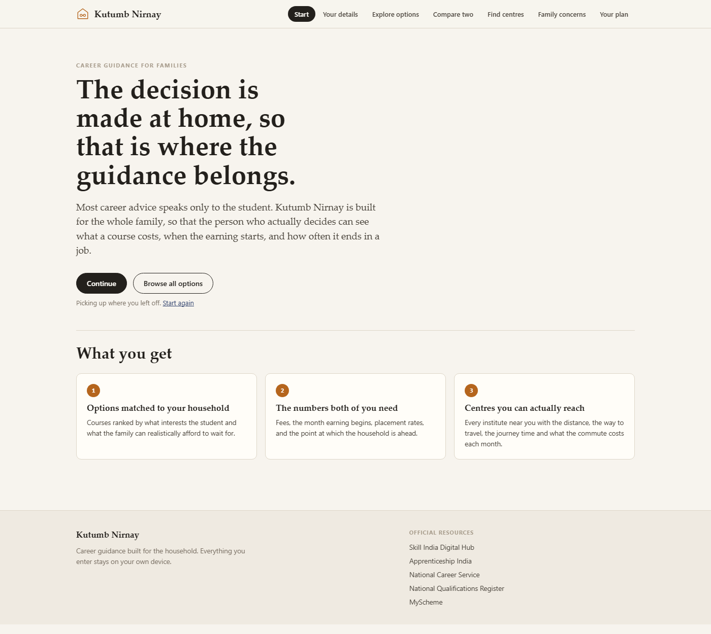
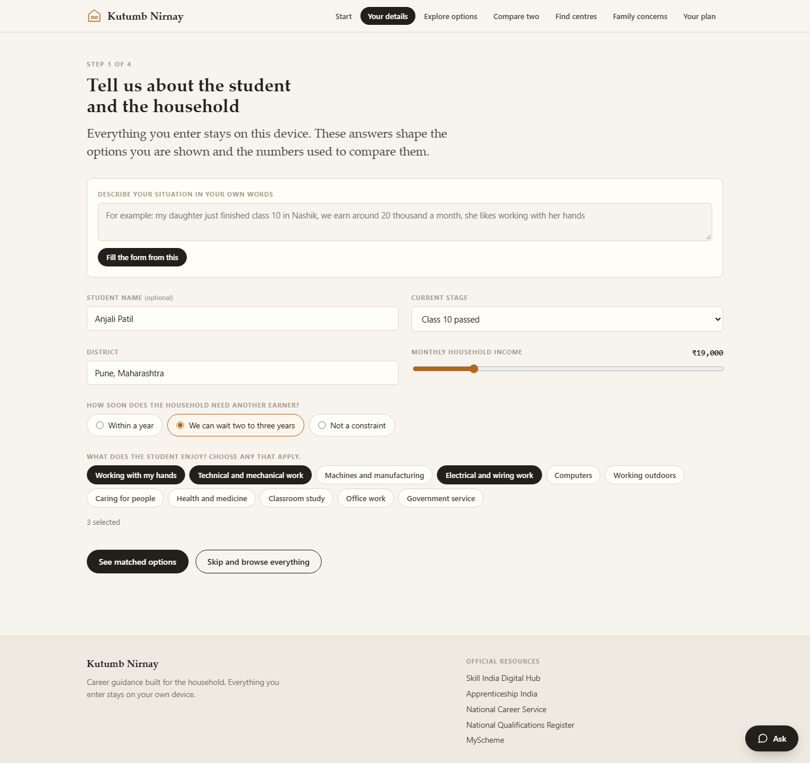
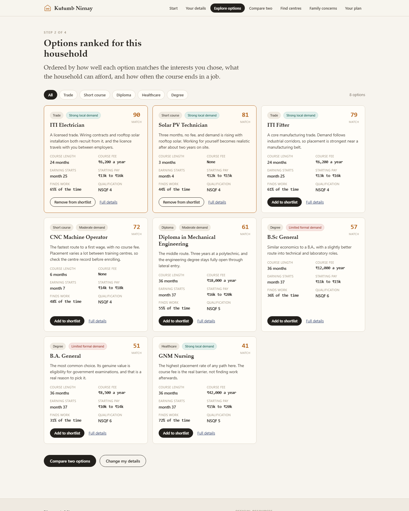
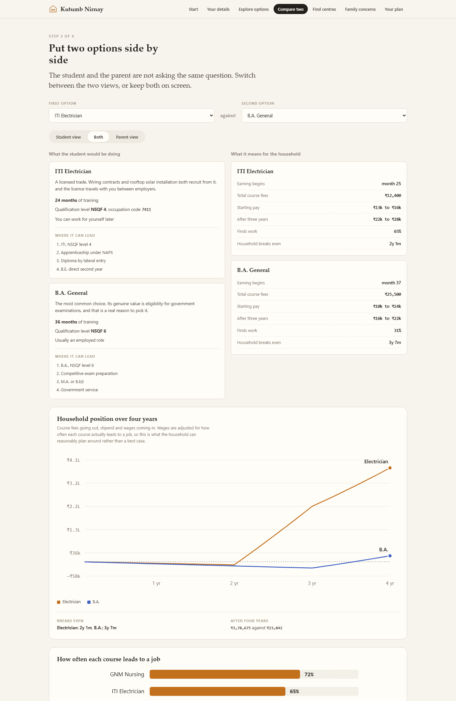
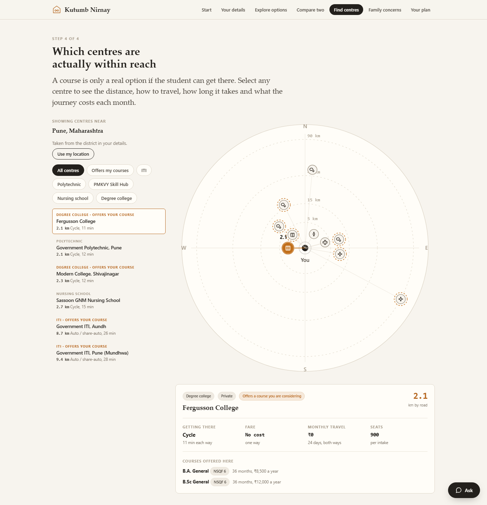
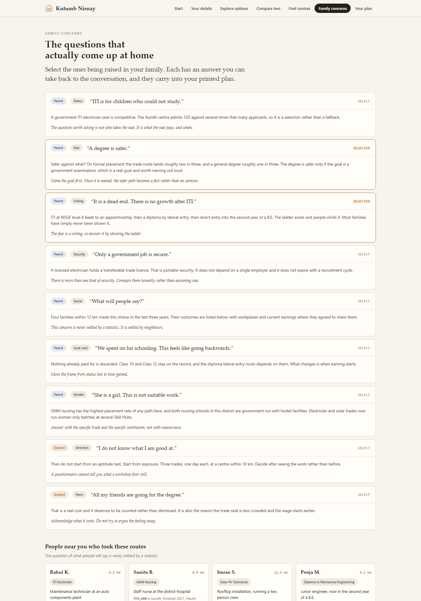
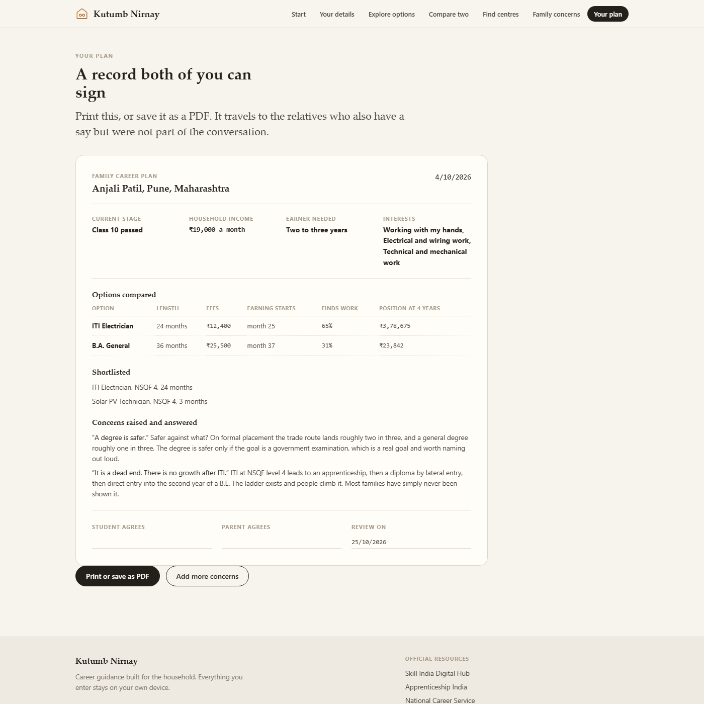
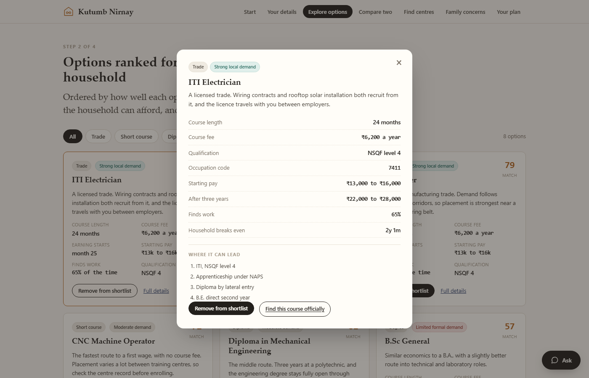

# Kutumb Nirnay, detailed report

Problem Statement SIH26241, Ministry of Skill Development and Entrepreneurship.
AI-Enabled Career Counselling and Family Decision-Support Platform for Vocational Education.

A six slide deck cannot carry reasoning. This report sets out why the problem was read the
way it was, what the software actually computes, where the data comes from, how every
screen works, and what is still missing. It is written to be read start to finish.

Working prototype: https://kutumb-nirnay.vercel.app
Landing page: https://akshayoggisetty.github.io/kutumb-nirnay-landing/
Source: https://github.com/AkshayOggisetty/kutumb-nirnay


## 1. Why this is not a problem of missing information

The obvious reading of this problem statement is that students do not know which
vocational courses exist, and that an AI recommender would solve it. That reading is
wrong, and the evidence says so.

The Skill India Digital Hub has been running since September 2023. It carries more than
7,500 courses, runs AI based personalised recommendations, issues NCVET verified
certificates, and already integrates PMKVY, NAPS, NATS, NCS and DDU-GKY. Around 1.5 crore
candidates and 7,000 training providers are on it. The student facing discovery problem
has a national solution, built by the same ministry that owns this problem statement.
Rebuilding it would be redundant.

What has never been built is anything that addresses the person who actually decides.

The research on parental perception is consistent. Parents' beliefs, expectations and
cultural values dominate a student's career choice. Students default to the course their
parents or peers name, and those parents and peers often have no labour market information
themselves. Misconceptions about income and employment prospects in skilled trades harden
the attitude further. ITIs are read as low trust, last resort options, while degrees are
pursued for prestige and for eligibility to sit government examinations.

So the binding constraint is not that the student lacks a recommendation. It is that the
parent holds a veto and has never been handed anything capable of changing their mind. A
platform that speaks only to the student is arguing with the wrong person.

This is also the plainest reading of the problem statement's own title. It does not say
career counselling platform. It says Family Decision-Support Platform. The ministry has
already named the unit of decision. We built for it.


## 2. The finding that decided the architecture

There is a result in the aspiration literature that has a direct consequence for how this
should be built.

Role model and aspiration interventions do work. Exposure to vocational role models raises
occupational aspiration toward the presented occupation, and exposure to female leadership
has been shown to raise girls' educational attainment and career aspirations in India. But
a role modelling randomised trial found the effect is short lived and has largely
disappeared after about two weeks.

Every career platform on the market, and every competing prototype we have seen for this
problem statement, is shaped as a single pass. Register, take an assessment, receive a
recommendation, finish. If the measured half life of the effect is a fortnight, that shape
cannot work. The guidance has to persist across the decision window, from Class 10 results
through to admission deadlines, rather than terminating in a report.

That is why the product ends in a decision record with a review date rather than a
recommendation page, and why the roadmap is a return across the admission season rather
than a better questionnaire.

We also searched specifically for randomised evidence on parent targeted vocational
counselling in India and found none. There are parent intervention trials for child
nutrition, adolescent mental health, autism and education incentives, but not for this. We
state that as an open gap rather than as a claim of novelty we cannot verify.


## 3. What the software actually computes

It matters to separate what is genuinely calculated from what is illustrative content. The
following all run in the browser, with no server and no network call.

**Distance.** Haversine great circle distance between the household and each institute,
multiplied by 1.3 to approximate road distance. The 1.3 detour factor is the usual
planning approximation for Indian road networks. Institute coordinates are real place
coordinates, so the arithmetic behaves correctly.

**Travel inference.** Road distance is mapped onto seven bands: walk, cycle, auto or share
auto, city bus, state bus, train or state bus, and train with hostel advised. Each band
carries a speed and a fare function, producing journey time, one way fare, and a monthly
commuting cost assuming twenty four teaching days both ways. Anything beyond daily range is
flagged, and the interface says so rather than presenting an unreachable centre as a
viable option.

**Household cash flow.** This is the centre of the product. For each course the model walks
month by month from month one to month forty eight. Fees flow out for the duration of the
course. An apprenticeship stipend flows in where the course has one, for twelve months from
the month it begins. After the course ends a wage flows in, ramping linearly from the entry
band to the three year band across thirty six months.

The important detail is that the wage is multiplied by the course's placement rate. A
family should not plan against the best case, it should plan against the expected case. A
course with a 31 per cent placement rate contributes 31 per cent of its wage to the
projection. That single decision is what makes the comparison honest, and it is why the
degree route does not look artificially bad. It looks exactly as good as its placement rate
makes it.

From that series the model derives the cumulative household position at any month, the
break even month where the position first turns positive, and the crossover month where one
route overtakes the other.

**Course matching.** Each course is scored out of 100 against the stated interests, the
affordability of its fees relative to annual household income, how soon the household needs
another earner, and its placement rate. Changing any profile answer re-ranks the list.

**Charts.** Every chart is drawn from the computed series as inline SVG. There is no chart
library. The two series palette was validated against the page surface with a six check
accessibility validator covering lightness band, chroma floor, colourblind separation,
normal vision separation and contrast. The pair in use scores 26.8 Delta E under
protanopia, 26.2 under tritanopia and 30.4 under normal vision, and both colours clear a
3:1 contrast ratio. Magnitude charts use a single hue rather than the categorical pair,
because they encode amount rather than identity.

**What is illustrative.** Wage bands, placement rates, institute records, seat counts, fees
and the local outcome records are representative rather than measured. They are shaped to
the bands reported in the CAG performance audit of PMKVY. The production data path in
section 4 is identified and real, but it has not yet been executed.


## 4. Where the real data comes from

**Earnings by education level** come from the Periodic Labour Force Survey unit level
microdata, published by the National Statistical Office and freely downloadable from the
MoSPI microdata portal. PLFS disaggregates earnings by education level, state, sector, age
and gender, which is the exact shape the parent view needs.

**The join between a course and a wage** comes from the NCVET report mapping NSQF
Qualification Packs to NCO codes, published in May 2025. Without this mapping there is no
defensible way to connect a training course to an earnings distribution. With it, the chain
runs course, to Qualification Pack, to NCO code, to PLFS earnings.

**Occupation taxonomy** comes from NCO-2015, which defines 3,600 occupations across 52
sectors in an eight digit hierarchical structure aligned to ISCO.

**District level demand** comes from the NSDC district wise skill gap studies, published per
state. This matters because the CAG audit found PMKVY training was largely not aligned with
sector specific and region specific skill gaps, and named the absence of micro level skill
gap assessment as a cause.

**Institutes** come from the DGT ITI directory, 15,024 institutes of which 3,291 are
government and 11,733 private, together with the PMKVY training centre registry and AISHE
college listings.

**Live vacancy signal** is available from the National Career Service open data catalogue
on data.gov.in, which exposes a catalogue API.


## 5. On integration, and why the app is standalone

We considered integrating directly with the Skill India Digital Hub and DigiLocker. We did
not, and the reason is a design decision rather than an omission.

SIDH exposes an open API stack, and DigiLocker offers partner APIs over OAuth 2.0. Both
require formal onboarding through API Setu with issued credentials. That process is not
available on this timeline. Building against a mocked version of an API we have never
called, then presenting it as an integration, would be a claim we could not defend under
questioning.

What we did instead is design so that integration becomes a configuration change rather
than a rewrite. NSQF levels, NCO codes and Qualification Pack identifiers are first class
fields in the data model rather than display strings. Every external surface sits behind an
adapter boundary with a local implementation. Swapping it for a live one does not touch the
interface or the model.

And every recommendation terminates in a real government destination that needs no
authentication: Skill India Digital Hub for enrolment, Apprenticeship India for NAPS, the
National Career Service for jobs, the National Qualifications Register for the
qualification file, MyScheme for eligibility, and DigiLocker for the certificate. Advice
that ends in a working link is more useful than advice that ends in a score.


## 6. The screens

### 6.1 Start



The opening screen states what the product is for and what the family will get. There is a
single primary action. If a profile already exists on the device the button reads Continue
and a quiet link offers to start again, so a returning family is never made to re-enter
everything.

The three cards below set expectations for the four steps that follow: options matched to
the household, the numbers both parties need, and centres that can actually be reached.

### 6.2 Your details



Intake is short and asks about the household rather than the student's personality. Name,
which is optional and used only on the printed plan. Current stage. District. Monthly
household income on a slider that updates live. How soon the household needs another
earner, which is the question that most changes which courses make sense. And what the
student enjoys, as a set of selectable chips.

The primary button stays disabled until at least one interest is chosen, because without
one the ranking has nothing to work with. A second button lets anyone skip straight to
browsing everything, so the form is never a wall.

Everything entered is written to browser storage immediately and survives a reload.

### 6.3 Explore options



Eight courses, each scored out of 100 for this specific household and sorted by that score.
The score combines interest match, affordability against the stated income, how soon an
earner is needed, and the placement rate.

Each card carries the six facts that decide the question: course length, course fee, the
month earning begins, starting pay, how often it leads to work, and the qualification
level. Courses can be filtered by family, and any course can be added to a shortlist that
carries through to the plan.

Full details opens a dialog with the complete record, the progression ladder, and a link
out to the official enrolment service.

### 6.4 Compare two



Two courses side by side, with a switch between the student view, the parent view, and
both. The student column covers what the work is, the qualification level and where it can
lead. The parent column covers fees, the month earning begins, starting pay, the three year
figure, how often it leads to work, and the month the household breaks even.

Below that sits the household balance chart, which plots cumulative position month by month
for both routes across four years, with a hover readout at any month. The summary line
states the break even month for each and the position at four years.

### 6.5 Find centres



A map centred on the household. Direction is given by the angle around the circle and
distance by the radius, on a square root scale so nearby centres are not cramped together.
Distance rings are drawn at 5, 15, 40 and 90 km.

The map is drawn rather than loaded from a tile service. There is no tile server, no API
key and no network dependency, so it opens on a weak connection and stays legible on a
projector. Markers and list rows are both clickable and keyboard reachable, and each marker
carries a generous invisible hit area so it is easy to tap on a phone.

Selecting a centre fills the panel below with travel mode, journey time each way, one way
fare, monthly commuting cost, seat count and the courses offered there. Centres beyond
daily travelling range are flagged with a note that hostel cost belongs in the plan. Browser
geolocation is used where the family grants it, with a silent fallback to the district.

### 6.6 Family concerns



Nine concerns that families actually raise, seven from parents and two from students. Each
shows the sentence as it is said, an evidence based answer, and a note on how to hold the
conversation. Selecting one records it so it carries into the plan.

Below sit five local outcome records: what someone nearby studied, where they work now and
what they earn. One of the five deliberately shows a graduate preparing for state services
with no wage yet. A tool that only ever recommends the trade is propaganda, and a parent
will detect that within one session. The credibility of the whole product depends on
showing the cases where vocational is not the answer.

### 6.7 Your plan



The output is a decision record rather than a recommendation. It carries the student name
and district, the current stage, household income, how soon an earner is needed, the stated
interests, a comparison table of the two courses with fees and break even, the shortlist,
the concerns raised and answered, signature lines for both student and parent, and a review
date set three weeks out.

It prints. That is deliberate. Parents trust paper, and paper travels to the relatives and
elders who also have a say but were never in the room.

### 6.8 Course details



Opened from any card. The complete record for one course, including the occupation code,
the full pay range, the break even month and the progression ladder, with a direct link to
the official service where the course can actually be enrolled in.


## 7. Testing

The prototype has an automated interaction test suite that drives a real browser. It covers
all 7 navigation routes, every form control, chip toggling, the shortlist, the detail
dialog, both compare selectors, all three view switches, map marker clicks, list row
clicks, centre type filters, concern selection, plan generation from entered data, reload
persistence, and the reset path. It also asserts that no long dashes and no Devanagari text
appear anywhere in the interface, and it fails the run if the browser logs any console
error, page error or failed request.

Current state: 60 checks, all passing, no console errors.

```
node test/run.mjs http://localhost:8081
```


## 8. What is missing

The course, wage and centre data is illustrative. The production data path in section 4 is
real and identified, but it has not been executed.

There is no live government integration, for the reasons in section 5.

There is no account and no server. State lives in browser storage on one device. That is
right for the current stage and inadequate for the longitudinal return the design argues
for, which is the first thing a production build would add.

The conversational layer is described in the architecture but is not wired in. The concern
content is authored rather than generated. We think authored content is correct for this
use, since an objection about marriage prospects is not something to improvise in front of
a family, but the conversation around it is genuine future work.

The local outcome records are the most sensitive part of the design. In production they
require informed consent, and that consent flow is not trivial, because publishing a named
person's earnings to their neighbours is exactly the kind of feature that can go wrong.

The map covers 45 institutes across ten cities. The real directory is 15,024 ITIs plus
polytechnics, nursing schools and colleges.

Voice input is in the architecture and not yet in the build.


## 9. What we would build next, in order

Wire PLFS microdata through the NCVET Qualification Pack to NCO mapping and replace the
illustrative wage bands with real distributions, carrying their uncertainty rather than a
single point estimate.

Load the DGT ITI directory in full so the map is exhaustive.

Add an account and the return across the admission season, which is the part the two week
decay result says actually matters.

Ship on WhatsApp with voice in the home language. The evidence on reaching this audience is
clear. WhatsApp bots outperform IVR on both cost and usability in rural deployments, speech
interfaces outperform touch tone for low literate and literate users alike, and there are
production precedents in Indian government service delivery. Parents will not install an
app. They already have WhatsApp.

Build the counsellor console, so the roughly 10,000 counsellors serving 26.5 crore students
receive triaged cases rather than being replaced by a chatbot.

Close the outcome loop. Record what families chose and what happened. Over time that
becomes district level labour market information, which is what the CAG audit found missing
from national skilling planning.


## 10. Sources

CAG, Performance Audit of Pradhan Mantri Kaushal Vikas Yojana, Report No. 20 of 2025.
https://cag.gov.in/uploads/download_audit_report/2025/Report-No.-20-of-2025_PA-PMKVY_English-PDF-A-06943abec463479.68516873.pdf

PRS Legislative Research, summary of the CAG PMKVY report.
https://prsindia.org/policy/report-summaries/skill-development-under-pm-kaushal-vikas-yojana

Periodic Labour Force Survey microdata, NSO and MoSPI.
https://microdata.gov.in/NADA/index.php/catalog/PLFS

NCVET, Report on Mapping of Qualifications with NCO Codes, May 2025.
https://ncvet.gov.in/wp-content/uploads/2025/05/Report-on-Mapping-of-Qualifications-with-NCO-Codes.pdf

National Classification of Occupations 2015, Volume I.
https://www.ncs.gov.in/documents/national%20classification%20of%20occupations%20_vol%20i-%202015.pdf

NSDC state and district skill gap reports.
https://www.nsdcindia.org/nsdcreports

Skill India Digital Hub.
https://www.skillindiadigital.gov.in

National Career Service open data catalogue.
https://www.data.gov.in/catalog/national-career-service-ncs

NITI Aayog, Reimagining Skilling for Viksit Bharat at 2047.
https://www.niti.gov.in/node/2397

Influence of Parental Perception on Students' Willingness to Pursue Vocational Careers.
https://www.researchgate.net/publication/398424840_Influence_of_Parental_Perception_on_Students'_Willingness_to_Pursue_Vocational_Careers_A_Synthesis_of_Literature

The time sensitivity of aspirational interventions, evidence from a role modelling RCT.
https://journals.plos.org/plosone/article?id=10.1371%2Fjournal.pone.0350832

Aspirations, Poverty and Education, Evidence from India, IZA DP 13697.
https://docs.iza.org/dp13697.pdf

FormBharo, designing and evaluating a voice agent for conversational form filling in rural India.
https://arxiv.org/pdf/2608.06027

API Setu onboarding guidelines, NEGD.
https://negd.gov.in/wp-content/uploads/2025/06/Guidelines-for-Onboarding-for-API-as-a-service-provider-v15-Rev-1-1.pdf


Prototype, design and content by Ishita Choudhary.
