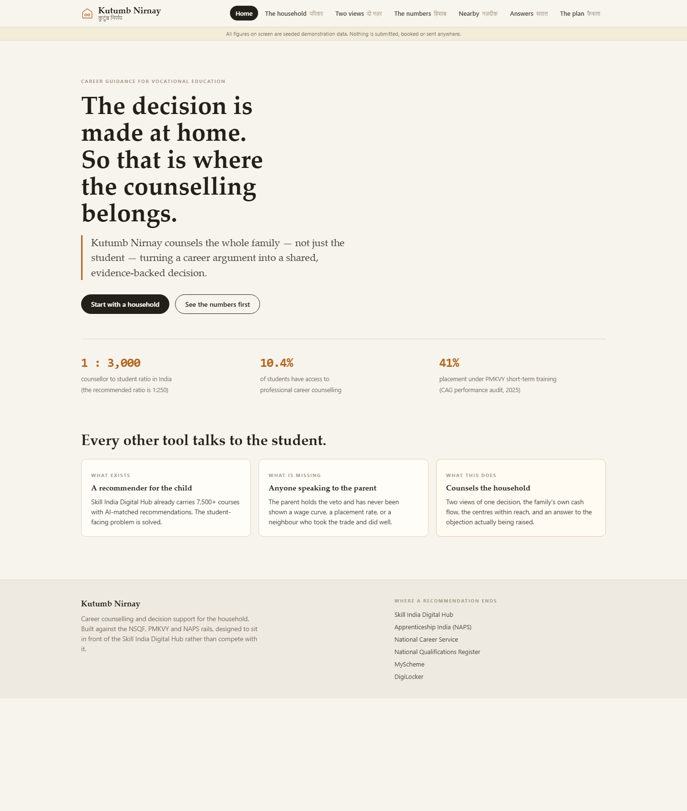
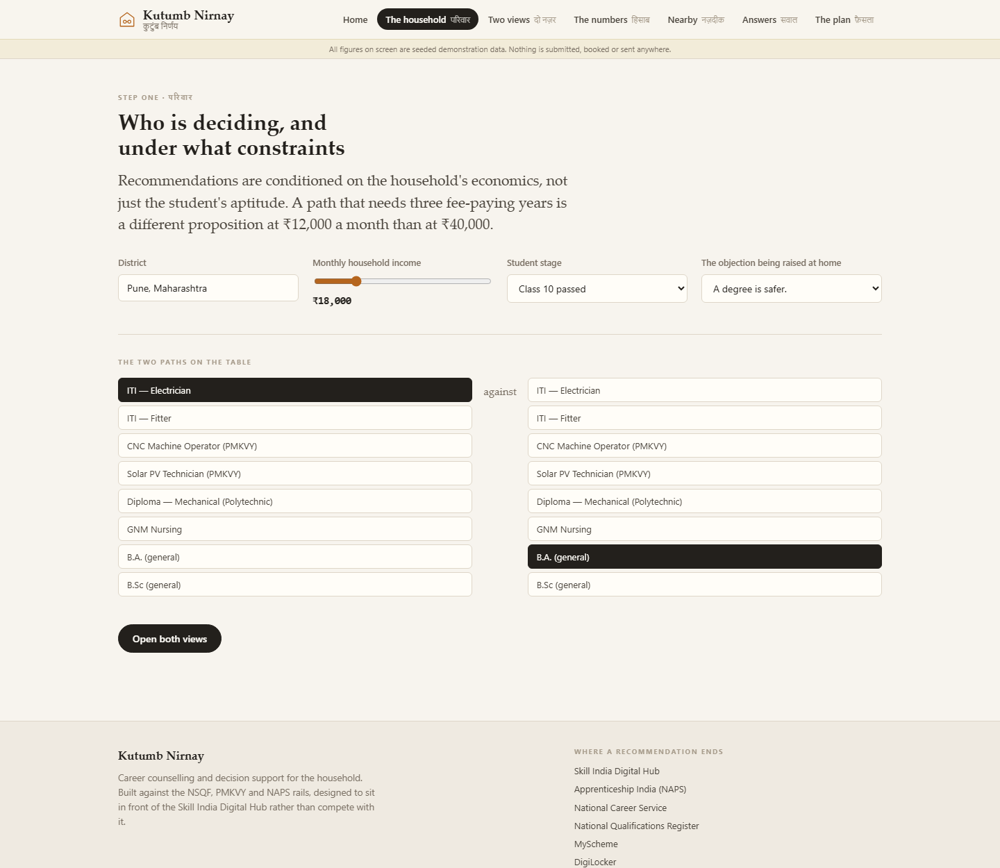
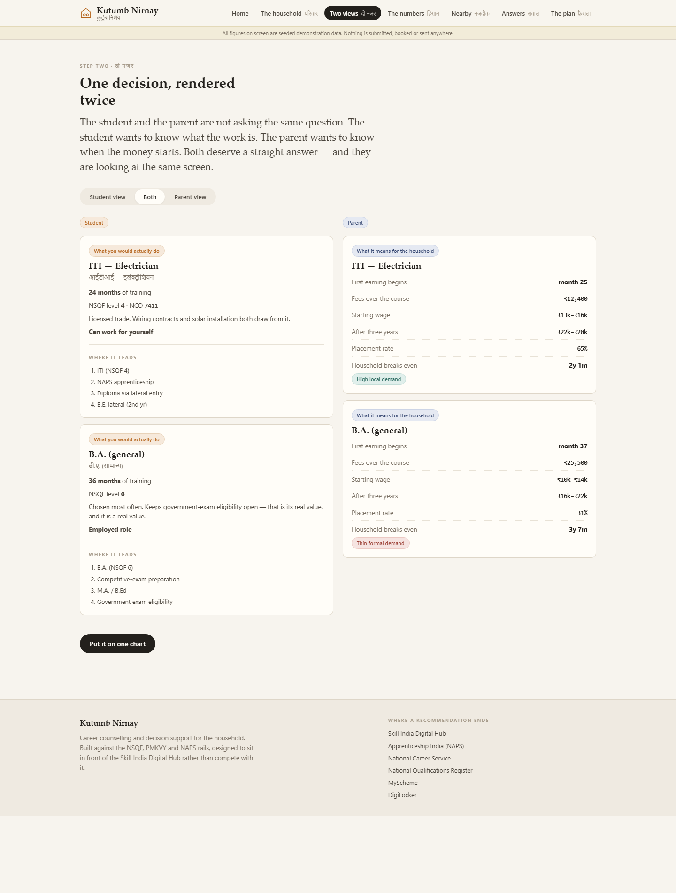
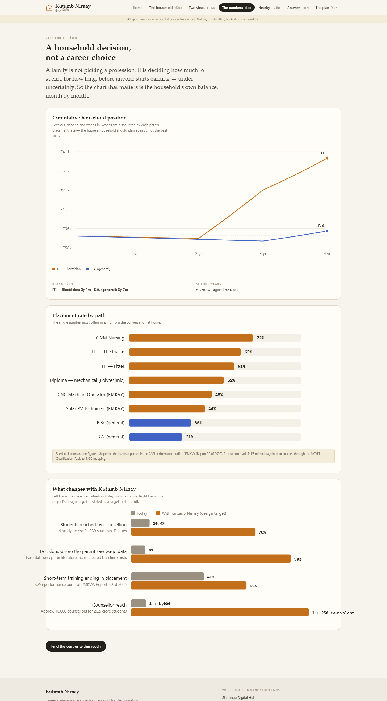
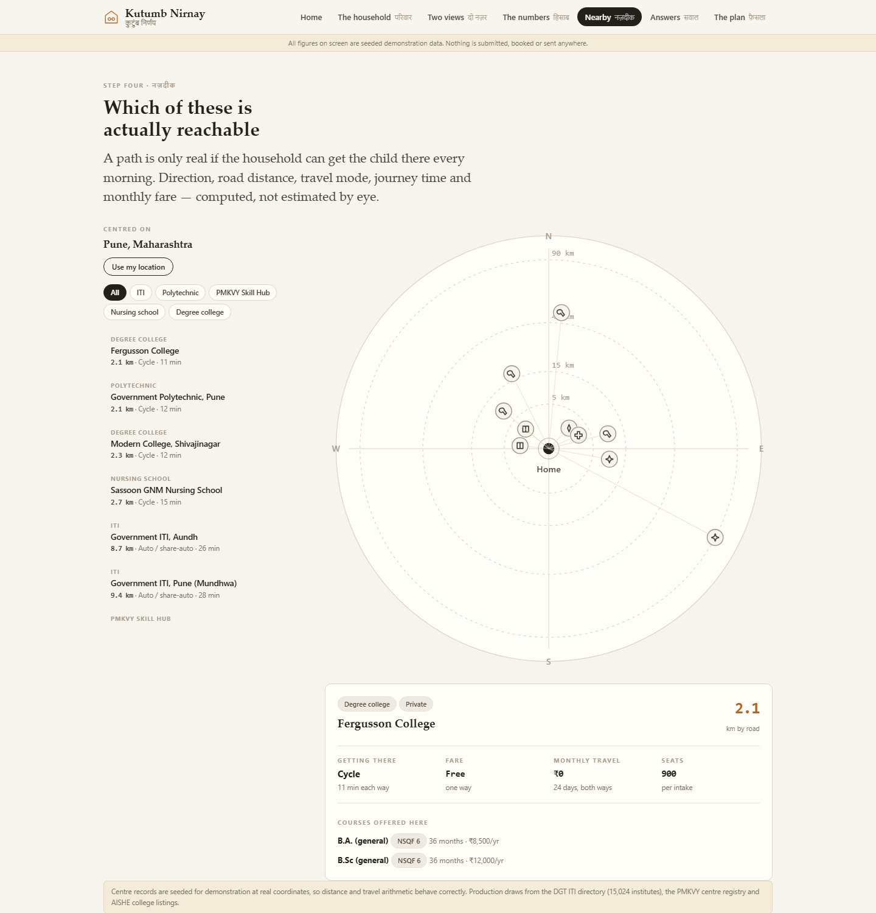
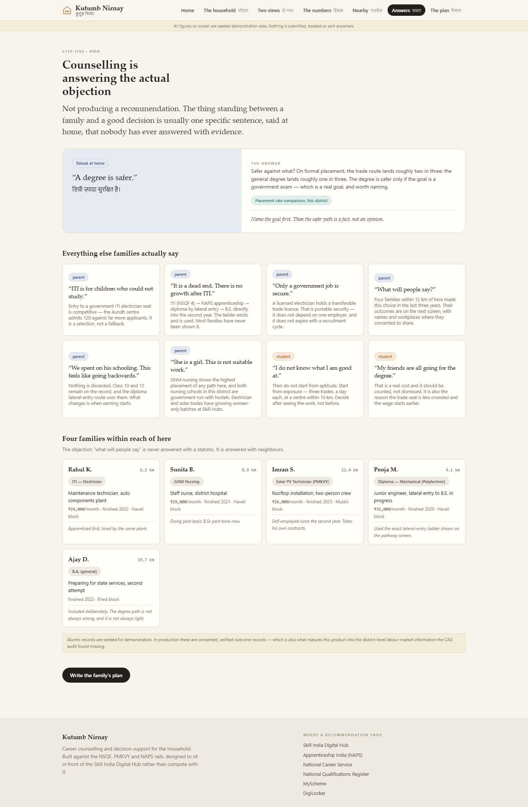
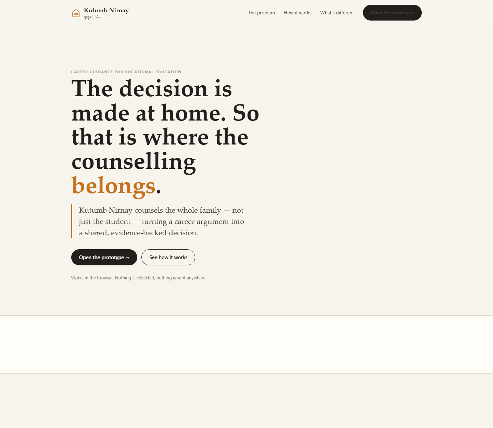

# Kutumb Nirnay — Detailed Report

Problem Statement SIH26241, Ministry of Skill Development and Entrepreneurship.
AI-Enabled Career Counselling and Family Decision-Support Platform for Vocational Education.

This report covers what a six-slide deck cannot. It explains the reasoning behind the
design, documents the arithmetic the prototype actually runs, walks through every screen
with a screenshot, states plainly which figures are real and which are seeded, and sets out
the limitations we are aware of.

Live prototype: https://akshayoggisetty.github.io/kutumb-nirnay/
Landing page: https://akshayoggisetty.github.io/kutumb-nirnay-landing/
Source: https://github.com/AkshayOggisetty/kutumb-nirnay

## 1. Why this problem is not an information problem

The obvious reading of this problem statement is that students do not know what vocational
courses exist, and that an AI recommender would fix that. We think that reading is wrong,
and the evidence says so.

The Skill India Digital Hub has been live since September 2023. It carries more than 7,500
courses, runs AI-based personalised recommendations, issues NCVET-verified certificates,
and integrates PMKVY, NAPS, NATS, NCS and DDU-GKY. Roughly 1.5 crore candidates and 7,000
training providers are on it. The student-facing discovery problem has a national solution
already, built by the ministry that owns this problem statement. Rebuilding it would be
both redundant and slightly embarrassing.

What has not been built is anything that addresses the person who actually decides.

The literature on parental perception is consistent. Parents' beliefs, expectations and
cultural values dominate a student's career choice. Students default to the course their
parents or peers name, and those parents and peers frequently have no labour-market
information themselves. Misconceptions about income potential and employment prospects in
skilled trades harden the attitude further. ITIs are read as low-trust, last-resort
options, while degrees are pursued for prestige and for government-exam eligibility.

So the binding constraint is not that the student lacks a recommendation. It is that the
parent holds a veto and has never been handed anything capable of changing their mind. A
platform that speaks only to the student is arguing with the wrong person.

This is also the plainest reading of the problem statement's own title. It does not say
"career counselling platform". It says "Family Decision-Support Platform". The ministry has
already named the unit of decision. We built for it.

## 2. The second finding that shaped the design

There is a result in the aspiration-intervention literature that we think most teams will
miss, and it has a direct architectural consequence.

Role-model and aspiration interventions do work — exposure to vocational role models raises
occupational aspiration toward the presented occupation, and exposure to female leadership
has been shown to raise girls' educational attainment and career aspirations in India. But
a role-modelling randomised trial found the effect is short-lived and effectively
disappears after about two weeks.

Every career platform on the market, and every competing prototype we have seen for this
problem statement, is shaped as a single pass: register, take an assessment, receive a
recommendation, done. If the measured half-life of the effect is a fortnight, that shape
cannot work. The counselling has to persist across the decision window — from Class 10
results through to admission deadlines — rather than terminate in a report.

That is why the product ends in a decision record with a review date rather than a
recommendation page, and why the roadmap is a drip over the admission season rather than a
better questionnaire.

We also searched specifically for randomised evidence on parent-targeted vocational
counselling in India and did not find any. There are parent-intervention trials for child
nutrition, adolescent mental health, autism, and education incentives, but not for this.
We state that as an open gap rather than a claim of novelty we cannot verify.

## 3. What the prototype actually computes

It matters to separate the parts that are genuinely implemented from the parts that are
illustrative. The following are real computations running in the browser, with no server
and no network call.

Distance. Haversine great-circle distance between the household's coordinates and each
institute, multiplied by 1.3 to approximate road distance. The 1.3 detour factor is the
usual planning approximation for Indian road networks. Institute coordinates are real place
coordinates, so the arithmetic behaves correctly even though the records are illustrative.

Travel inference. Road distance is mapped onto seven bands — walk, cycle, auto or
share-auto, city bus, state bus, train or state bus, and train with hostel advised. Each
band carries a speed and a fare function, which yield journey time, one-way fare, and a
monthly commuting cost assuming twenty-four teaching days both ways. Bands beyond daily
range are flagged as not commutable, and the interface says so rather than quietly
presenting an unreachable centre as an option.

Household cash flow. This is the centre of the product. For each path the model walks
month by month from month one to month forty-eight. Fees flow out for the duration of the
course. An apprenticeship stipend flows in where the path has one, for twelve months from
the month it begins. After the course ends, a wage flows in, ramping linearly from the
entry band to the three-year band across thirty-six months.

The important detail is that the wage is multiplied by the path's placement rate. A family
should not plan against the best case; it should plan against the expected case. A path
with a 31% placement rate contributes 31% of its wage to the projection. This single
decision is what makes the comparison honest, and it is why the degree path does not look
artificially bad — it looks exactly as good as its placement rate makes it.

From that series the model derives the cumulative household position at any month, the
break-even month where cumulative position first turns positive, and the crossover month
where one path overtakes the other, if it does.

Charts. Every chart is drawn from the computed series as inline SVG — there is no chart
library. The two-series palette was validated against the page surface with a six-check
accessibility validator: lightness band, chroma floor, colourblind separation, normal-vision
separation and contrast. The pair in use scores 26.8 Delta E under protanopia, 26.2 under
tritanopia and 30.4 under normal vision, and both colours clear 3:1 contrast. Magnitude
charts use a single hue rather than the categorical pair, because they encode amount rather
than identity.

What is seeded. Wage bands, placement rates, institute records, seat counts, fees, demand
labels and alumni outcomes are all illustrative. They are shaped to the bands reported in
the CAG performance audit of PMKVY, but they are not measured data and the interface says
so on every screen that shows them. We would rather be obviously honest about this than
have a judge discover it.

## 4. Where the real data comes from in production

The prototype is seeded, but the data path is not hypothetical. Each required figure has an
identified public source.

Earnings by education level come from the Periodic Labour Force Survey unit-level
microdata, published by the National Statistical Office and freely downloadable from the
MoSPI microdata portal. PLFS disaggregates earnings by education level, state, sector, age
and gender, which is precisely the shape the parent view needs.

The join between a course and an occupation — and therefore between a course and a wage —
comes from the NCVET report mapping NSQF Qualification Packs to NCO codes, published in May
2025. Without this mapping there is no defensible way to connect a training course to an
earnings distribution. With it, the chain runs course to Qualification Pack to NCO code to
PLFS earnings.

Occupation taxonomy comes from NCO-2015, which defines 3,600 occupations across 52 sectors
in an eight-digit hierarchical structure aligned to ISCO.

District-level demand comes from the NSDC district-wise skill gap studies, published
per-state. This matters because the CAG audit found that PMKVY training was "largely not
aligned with actual sector-wise and region-specific skill gaps", and named the absence of
micro-level skill-gap assessment as a cause.

Institutes come from the DGT ITI directory — 15,024 institutes, of which 3,291 are
government and 11,733 private — together with the PMKVY training-centre registry and AISHE
college listings.

Live vacancy signal is available from the National Career Service open data catalogue on
data.gov.in, which exposes a catalogue API.

## 5. On integration, and why the prototype is standalone

We considered integrating directly with the Skill India Digital Hub and DigiLocker. We did
not, and the reason is worth stating because it is a design decision rather than an
omission.

SIDH exposes an open API stack, and DigiLocker offers partner APIs over OAuth 2.0. Both
require formal onboarding through API Setu, with issued credentials. That process is not
available on a hackathon timeline. Building against a mocked version of an API we have
never called, and then presenting it as an integration, would be a claim we could not
defend under questioning.

What we did instead is design so that integration is a configuration change rather than a
rewrite. NSQF levels, NCO codes and Qualification Pack identifiers are first-class in the
data model rather than display strings. Every external surface sits behind an adapter
boundary with a seeded local implementation. Swapping the seeded provider for a live one
does not touch the interface or the model.

And every recommendation in the prototype terminates in a real government destination that
needs no authentication: Skill India Digital Hub for enrolment, Apprenticeship India for
NAPS, the National Career Service for jobs, the National Qualifications Register for the
qualification file, MyScheme for eligibility, and DigiLocker for the certificate. Advice
that ends in a working link is more useful than advice that ends in a score.

## 6. The screens

### 6.1 Home

The opening screen states the thesis in one sentence and then immediately substantiates it
with three sourced numbers: the 1:3,000 counsellor-to-student ratio against a 1:250
recommendation, the 10.4% of students with access to professional counselling found in a UN
study across 21,239 students in seven states, and the 41% placement rate for short-term
training from the CAG audit.

Below that, the three-card band does the competitive positioning explicitly — what already
exists, what is missing, and what this does. We put this on the first screen deliberately.
A reviewer who knows the sector will immediately ask how this differs from the Skill India
Digital Hub, and the answer should not be buried.

### 6.2 The household

Intake is deliberately short and asks about the household rather than the student's
personality. District, monthly household income, the student's stage, and — the unusual
field — the objection currently being raised at home, chosen from a list of the things
families actually say.

That last field is the one no other tool has. It routes the entire downstream experience:
the objection chosen here is the one answered on the Answers screen. The product is built
around the assumption that there is a specific sentence blocking the decision, and that
naming it is the first step.

Below intake, the family picks the two paths genuinely on the table. The default comparison
is ITI Electrician against a general B.A., because that is the most common real fork, but
all eight paths are selectable on either side.

### 6.3 Two views

The same decision rendered twice, side by side, with a lens switch for showing either view
alone when one party is in the room.

The student column answers what the work is: duration, NSQF level, NCO code, whether the
trade supports self-employment, and the progression ladder. The ladder is important — it
attacks the "dead end" objection structurally rather than rhetorically, by showing ITI to
NAPS apprenticeship to diploma by lateral entry to direct second-year B.E. entry.

The parent column answers a different question entirely: when earning begins, total fees
over the course, starting wage band, the three-year band, placement rate, and the month the
household breaks even. Same path, same screen, different question answered.

### 6.4 The numbers

Three charts.

The cumulative household position chart is the heart of the product. It plots both paths'
month-by-month household balance across four years. In the default comparison the ITI path
breaks even at 2 years 1 month and the B.A. at 3 years 7 months, and at four years the
household is roughly 3.78 lakh ahead on the trade route. That gap is large, and it is
entirely a consequence of two facts: the trade route starts earning a year earlier, and it
places at roughly twice the rate.

The placement-rate chart puts all eight paths on one axis. It is the single number most
often absent from the conversation at home, and seeing GNM nursing at 72% next to a general
B.A. at 31% does more work than any argument.

The third chart is the one that answers "what changes with this project". Left bars are
measured today with their source printed underneath; right bars are design targets,
labelled as design targets. We were careful here. It would be easy to present the right-hand
bars as outcomes. They are intentions, and the chart says so.

### 6.5 Nearby

A radial plan centred on the household. Bearing gives direction, radius gives distance on a
square-root scale, and distance rings are drawn at 5, 15, 40 and 90 km.

The map is drawn rather than tiled. There is no tile server, no API key and no network
dependency, so it works on a weak connection and a cheap phone, and it stays legible on a
projector in a lit room. Clicking any mark or list row opens the detail panel with travel
mode, journey time each way, one-way fare, monthly commuting cost, seat count and the
courses offered at that centre.

Centres beyond daily-commute range are explicitly flagged, with a note that hostel cost
belongs in the household plan. This is the kind of thing that decides whether a path is
real for a particular family, and no career platform currently surfaces it.

Browser geolocation is used where granted, with a silent fallback to a default district, so
the screen is never broken by a denied permission.

### 6.6 Answers

The objection-handling engine. The objection selected during intake is given the full
treatment — the sentence as it is actually said, in English and Hindi, then an
evidence-based answer, the evidence tag, and a note on how to hold the conversation.

Below it sit the other objections families raise: that ITI is for children who could not
study, that the degree is safer, that it is a dead end, that only a government job is
secure, what people will say, that the schooling spend is wasted, that it is unsuitable for
a daughter, and two from the student's side. Each can be marked as worked through, and
those marks carry into the plan.

Then the local alumni. Five verified outcomes within reach, with distance, trade, current
role, current wage and a note. One of the five deliberately shows a B.A. graduate preparing
for state services with no wage yet. A tool that only ever recommends the trade is
propaganda, and a parent will detect that within one session. The credibility of the whole
product rests on showing the cases where vocational is not the answer.

### 6.7 The plan

The output is a decision record, not a recommendation. It carries the district, the
student's stage, household income, the two paths weighed, the position at four years, the
concerns raised and answered, the concerns still open, signature lines for both student and
parent, and a review date set three weeks out.

It prints. That is deliberate rather than a fallback. Parents trust paper, and paper travels
to the relatives and elders who also get a say in the decision but were never in the room.

### 6.8 Landing page

A separate single-file static site for the product itself, carrying the same type and
colour tokens so the two read as one product. It states the problem, the six steps, the
contrast against existing career tools, and the reachability map, and it links to the
prototype.

## 7. Limitations we are aware of

The data is seeded. Every figure is shaped plausibly, but none of it is measured, and the
interface says so on every screen. The production data path in section 4 is real and
identified, but it has not been executed.

There is no live government integration, for the reasons given in section 5.

There is no account system, no persistence and no backend. State lives in memory for the
session. This is appropriate for a demonstration and inadequate for the longitudinal drip
the design argues for — which is the first thing a production build would add.

The LLM dialogue layer is described in the architecture but is not wired into this
prototype. The objection content is authored rather than generated. We think authored
content is actually correct for this use — an objection about marriage prospects is not
something to improvise in front of a family — but the conversational layer around it is
genuine future work.

The alumni records are the most sensitive thing in the design. In production they require
informed consent, and the consent flow is non-trivial, because publishing a named person's
wage to their neighbours is exactly the kind of feature that can go wrong.

The map covers 45 seeded institutes across ten cities. The real directory is 15,024 ITIs
plus polytechnics, nursing schools and colleges.

## 8. What we would build next, in order

Wire PLFS microdata through the NCVET Qualification-Pack-to-NCO mapping and replace the
seeded wage bands with real distributions, including their uncertainty rather than a point
estimate.

Load the DGT ITI directory in full, so the map is exhaustive rather than illustrative.

Add persistence and the longitudinal drip across the admission window, which is the part the
two-week decay result says actually matters.

Ship on WhatsApp with voice in the home language. The evidence on reaching this audience is
clear: WhatsApp bots outperform IVR on both cost and usability in rural deployments, speech
interfaces outperform touch-tone for low-literate and literate users alike, and there are
production precedents in Indian government service delivery. Parents will not install an
app. They already have WhatsApp.

Build the counsellor console, so that the roughly 10,000 counsellors serving 26.5 crore
students receive triaged cases rather than being replaced by a chatbot.

Close the outcome loop. Record what families chose and what happened. Over time that becomes
district-grained labour-market information — which is precisely what the CAG audit found
missing from national skilling planning.

## 9. Sources

CAG, Performance Audit of Pradhan Mantri Kaushal Vikas Yojana, Report No. 20 of 2025.
https://cag.gov.in/uploads/download_audit_report/2025/Report-No.-20-of-2025_PA-PMKVY_English-PDF-A-06943abec463479.68516873.pdf

PRS Legislative Research, summary of the CAG PMKVY report.
https://prsindia.org/policy/report-summaries/skill-development-under-pm-kaushal-vikas-yojana

Periodic Labour Force Survey microdata, NSO / MoSPI.
https://microdata.gov.in/NADA/index.php/catalog/PLFS

NCVET, Report on Mapping of Qualifications with NCO Codes, May 2025.
https://ncvet.gov.in/wp-content/uploads/2025/05/Report-on-Mapping-of-Qualifications-with-NCO-Codes.pdf

National Classification of Occupations 2015, Volume I.
https://www.ncs.gov.in/documents/national%20classification%20of%20occupations%20_vol%20i-%202015.pdf

NSDC state and district skill gap reports.
https://www.nsdcindia.org/nsdcreports

Skill India Digital Hub.
https://www.skillindiadigital.gov.in

National Career Service open data catalogue.
https://www.data.gov.in/catalog/national-career-service-ncs

NITI Aayog, Reimagining Skilling for Viksit Bharat@2047.
https://www.niti.gov.in/node/2397

Influence of Parental Perception on Students' Willingness to Pursue Vocational Careers.
https://www.researchgate.net/publication/398424840_Influence_of_Parental_Perception_on_Students'_Willingness_to_Pursue_Vocational_Careers_A_Synthesis_of_Literature

The time sensitivity of aspirational interventions: evidence from a role-modeling RCT.
https://journals.plos.org/plosone/article?id=10.1371%2Fjournal.pone.0350832

Aspirations, Poverty and Education: Evidence from India, IZA DP 13697.
https://docs.iza.org/dp13697.pdf

FormBharo: designing and evaluating a voice agent for conversational form filling in rural India.
https://arxiv.org/pdf/2608.06027

API Setu onboarding guidelines, NEGD.
https://negd.gov.in/wp-content/uploads/2025/06/Guidelines-for-Onboarding-for-API-as-a-service-provider-v15-Rev-1-1.pdf

Prototype, design and content by Ishita Choudhary.
